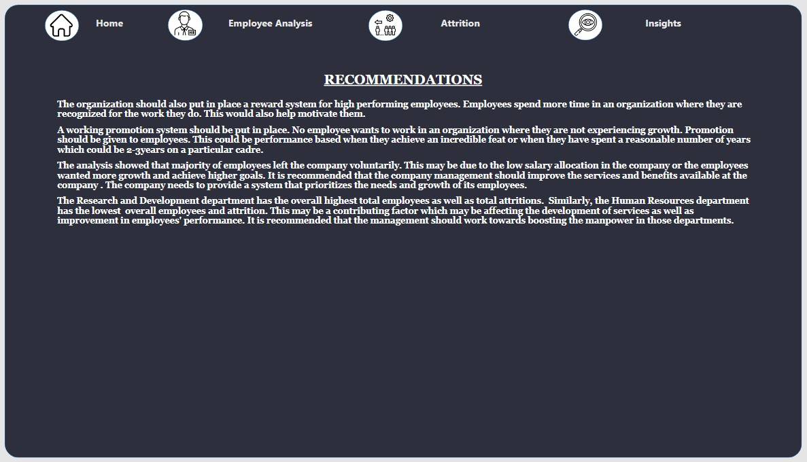

# GROWTH AND PERFORMANCE: Analyzing HR Data to Improve Employee Retention and Performance.

_Project Timeframe: 1/05/2023–05/05/2023_

## INTRODUCTION

Employees are the backbone of any successful organization. Any organization that seeks to achieve its goals and objectives must have talented, reliable, and motivated employees. Providing an enabling environment for growth is a key factor that encourages employee engagement and retention is also an essential responsibility of the organization. Every organization at one point in time loses its best talent, however, an organization should take necessary precautions and find the root cause when a significant number of employees are leaving over a certain period of time.

For this project, I worked on an HR dataset that contains the data of past and present employees as well as the administrative data of the organization. As usual, it is always exciting to analyze datasets that will drive real-world impacts. The aim of this project is to gain insights into factors that influence the retention and performance of employees in the organization in order to give recommendations on areas of improvement.

## PROBLEM STATEMENT

One of the biggest challenges facing HR departments today is how to retain and develop top talent.

By analyzing the HR data, I can gain insights into factors that affect employee retention and performance in the company as well as identify areas for improvement.

### Objectives

The objectives are to explore the salary, demographics, hires and terminations and any other areas you deem fit, and provide recommendations to improve employee retention and performance. To achieve this, we will;
- Determine attrition overall attrition rate
- Identify the causes of attrition

## SKILLS DEMONSTRATED

The tool used for the analysis was Microsoft Power BI. The Power BI concepts that were used include;
1. DAX (Data Analysis Expression) Concept for Calculated Measures.
2. Power Query Editor for data cleaning (Conditional Columns and Added Columns)
3. Data Modeling to create a one-to-many relationship between the different tables.

## DATA SOURCING

One of the key parts of the data analysis process is Data Preparation which involves gathering the necessary data to best accomplish the desired analysis. The dataset used for the project was provided by the Human Resources department of the company containing information on Employees, Job Satisfaction, Involvement, Performance, Gender, Education, Department, Hire type, Termination type, etc.

### Data Structure

As a data analyst, I took the time to carefully understand the dataset and planned how to best approach the data cleaning, transformation and analysis process without excluding key features. The HR dataset is structured in the Microsoft Excel workbook (.xlsx) file format. It contains 15 different but related tables, namely:

- Business_Travel: It has 2 columns and 3 rows, and contains the category of travel frequency of employees.
- Department: It has 2 columns and 3 rows, and contains the departments in the company.
- Education: It has 2 columns and 5 rows, and contains the level of education of employees.
- Employee: It has 38 columns and 1,470 rows, and contains the data of employees.
- Employment_Type: It has 2 columns and 2 rows, and contains the employment type of employees.
- Environment_Satisfaction: It has 2 columns and 4 rows, and contains the level of environment satisfaction of employees.
- Gender: It has 2 columns and 3 rows, and contains the gender type of employees.
- Hire_Type: It has 2 columns and 2 rows, and contains the hire type of employees.
- Job_Involvement: It has 2 columns and 4 rows, and contains the level of involvement of employees.
- Job_Role: It has 2 columns and 9 rows, and contains the job roles of employees.
- Job_Satisfaction: It has 2 columns and 4 rows, and contains the level of job satisfaction of employees.
- Performance: It has 2 columns and 4 rows, and contains the performance level of employees.
- Relationship_Satisfaction: It has 2 columns and 4 rows, and contains the relationship satisfaction level of employees.
- Termination_Type: It has 2 columns and 2 rows, and contains the job termination type of employees.
- Work_Life_Balance: It has 2 columns and 2 rows, and contains the quality of the work-life balance of employees.

## DATA TRANSFORMATION

Before commencing any analysis, the HR dataset was imported into Power Query on Microsoft Power BI.
Data cleaning is a key aspect of the data processing stage as it ensures data accuracy and credibility. Here, you can understand the data and identify inconsistencies.
The following transformations were done:

1. Removal of errors and duplicates present in the data for each table and column.
2. Check for blank cells or missing values in the dataset.
3. Correction of data types, especially dates.
4. Reduction of decimal places in columns having currency values.

_Power Query View_

Now that our data is squeaky clean, let’s jump into Power BI properly!

## MODELLING

I discovered that 14 tables out of all 15 available tables in the dataset had columns that were related to the “Employee” table. These columns served as the Foreign Keys for the fact (Employee) table. A one-to-many relationship was created to model the fourteen (14) tables together for easy analysis and visualization.

_A Star-Schema Data Model_

## ANALYSIS AND VISUALIZATIONS

In this step, we carried out an exploratory analysis of the data to answer the questions that were stated earlier.

First of all, I did a quick summary by calculating some important measures using DAX.

_Calculated Measures_

_Key Measures_

The visuals above show that out of 1,470 employees, only 1,233 are active employees giving an attrition rate of 16% (237). Also, there were more male employees than the females in the company having had 265 new hires at present.

### Question 1
What is the age distribution and gender of employees?

_Employees by Age Group & Gender_

This organization has an active workforce. More than 50% of its employees fall within the age bracket of 26–45 years and these are active work years.

### Question 2
What is the attrition trend amongst different departments and education levels?

_Attrition by department & education level_

Next, I moved on to the attrition analysis. Research & Development department (133) had the highest number of attrition over the years followed by the Sales department (92). The majority of those employees had a Bachelor’s degree (99).

### Question 3
What is the attrition trend between males and females?

_Attrition by Gender_

### Question 4
What is the attrition trend by distance status?

_Attrition by distance status_

With regards to the distance to the company, the majority (60.76%) of attritions lived near (<10 miles) the company followed by those that lived far (>10 miles).

### Question 5
Did employees leave voluntarily or involuntarily?

_Attrition by Termination types_

Voluntary attrition was the highest. This could result from a number of factors like low pay, poor working conditions, and lack of career growth.

### Question 6
Is performance indicators like Job Involvement, Job Satisfaction, and Performance Rating low amongst employees that left?

_Attrition by Performance Indicators_

Employees that left had a high value for each of these indicators. This means that performance is not a factor for them leaving the organisation. Comparing the average salary distribution, those who had an Outstanding performance get paid a lesser salary ($6,373) than those with Excellent performance ($6,652). Similarly, employees with a Low-performance rating are paid a higher salary ($5,866) than those with a Good performance rating ($5,797).

Here is the summary and insightful dashboard built from the data analysis.

       

        

## INSIGHTS

- Over the years, the company has employed 1,470 employees. The company has been able to retain 1,233 employees with 237 attritions and currently has 265 new hires (Male (170), Female (95)).
- The majority (572) of the employees had a Bachelor’s degree followed by a Master’s degree owned by employees (398). Similarly, attrition occurred mostly among employees with a Bachelor’s degree (99) followed by a Master’s (58).
- Based on employee performance, there are more employees who performed Excellently followed by employees with Outstanding performance.
- The average salary paid to employees over time is $6,500 while employees who left the company were paid an average of $4,790.
- Although there are more employees with excellent performance, those who had an Outstanding performance get paid a lesser salary ($6,373) than those with Excellent performance ($6,652). Similarly, employees with a Low-performance rating are paid a higher salary ($5,866) than those with a Good performance rating ($5,797).
- The age group 26–35 in Gender made up 25.03% of Total Employees. Employees in this age group have higher Males than Females.
- The majority of employees(1026) live Nearby which was 402.94% higher than those that live Very Far from the company location, which had the lowest total Employees at 204.
- The employment offered to most employees was Full-time making up 49.59% of total Employees. Employees for Males and females diverged the most when the Employment type was Full-time when Males were 251 higher than Females.
- Considering the average salary paid to employees before attrition, employees with Excellent performance were paid higher than those with Outstanding performance, and the highest-paid employees ($5,091) on attrition were paid below the overall average salary paid ($6,500).
- A larger percentage of employees left voluntarily, this could mean that employees are not satisfied with what the organization is offering. It is also important to note that employees that left the company had high scores in performance indicators like Job Involvement, Performance and Job satisfaction. This shows that employees had high performance but most were not well paid hence the turnover.

## RECOMMENDATIONS

- The organization should also put in place a reward system for high-performing employees. Employees spend more time in an organization where they are recognized for the work they do. This would also help motivate them.
- A working promotion system should be put in place. No employee wants to work in an organization where they are not experiencing growth. Promotion should be given to employees. This could be performance-based when they achieve an incredible feat or when they have spent a reasonable number of years which could be 2–3 years on a particular cadre.
- The analysis showed that the majority of employees left the company voluntarily. This may be due to the low salary allocation in the company or the employees wanting more growth and achieving higher goals. It is recommended that the company management should improve the services and benefits available at the company. The company needs to provide a system that prioritizes the needs and growth of its employees.
- The Research and Development department has the overall highest total employees as well as total attritions. Similarly, the Human Resources department has the lowest overall employees and attrition. This may be a contributing factor that may be affecting the development of services as well as improvement in employees’ performance. It is recommended that the management should work towards boosting the manpower in those departments.

## CONCLUSION

The analysis has provided valuable insights that can help the organization make informed decisions and take proactive measures to improve employee retention, engagement and performance. By addressing the key issues identified in the analysis, the organization can create a more positive and productive work environment that fosters employee satisfaction and long-term commitment to the company.

You can interact with the dashboard [here](https://app.powerbi.com/view?r=eyJrIjoiZGYxZTlkODctOTNiNS00YzM2LWJiYzktNjRiNWQzZjE4MmVlIiwidCI6ImE0Yjg5OWU1LTAyODgtNDAxOS04ODRhLTkzYmFmZjhkY2I2MyJ9)

I had a great and interesting experience working on this project. I hope you had as much fun as I did. Interact with the dashboard and let me know what you think!

_photo by Julie Blais Comeau_

_Your feedback is very important to me and my growth as a data analyst. Follow for more exciting data analysis projects from PsycheXAnalyst._
